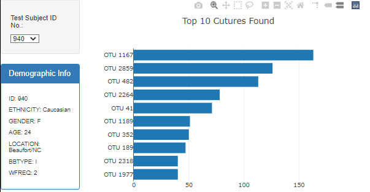
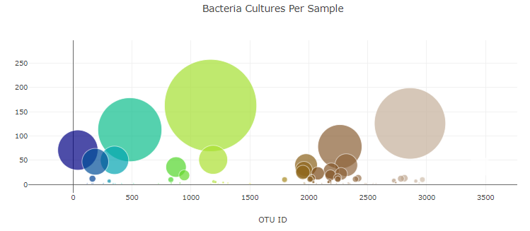
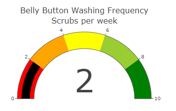
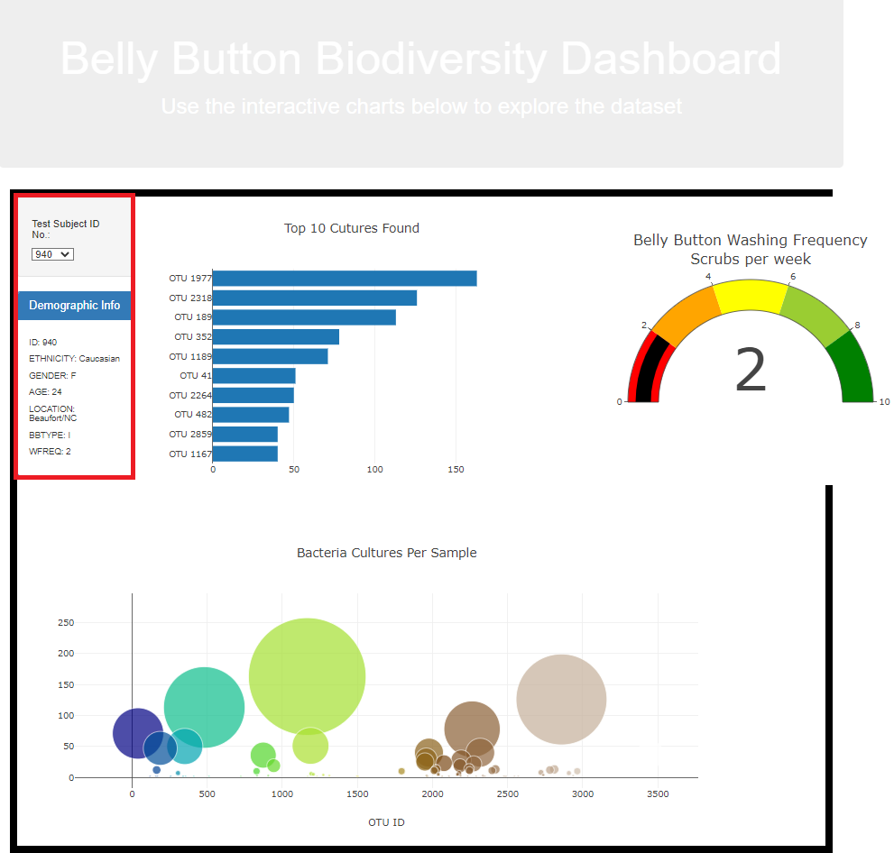

# plotlydiploy

# Overview of Project

The purpose of this project is create a horizontal bar chart to display the top 10 bacterial species (OTUs) when an individual’s ID is selected from the dropdown menu on the webpage. The horizontal bar chart will display the sample_values as the values, the otu_ids as the labels, and the otu_labels as the hover text for the bars on the chart. In addition, Plotly, and D3.js is used to create a bubble chart that will display the chart below when an individual’s ID is selected from the dropdown menu webpage. Finally, Plotly, and D3.js libraries are used to create a gauge chart that displays the weekly washing frequency's value, and display the value as a measure from 0-10 on the progress bar in the gauge chart when an individual ID is selected from the dropdown menu.

## Resources

- Visual Studio Code

- D3.js

- HTML

- Javascript

- CSS

- Bootstrap

### Results

The horizontal bar chart below displays the top 10 bacterial species (OTUs) when an individual’s ID is selected from the dropdown menu on the webpage

The bubble chart below displays different circles with different colors when an individual’s ID is selected from the dropdown menu webpage:

Finally, below is a gauge chart that displays the weekly washing frequency's value, and display the value as a measure from 0-10 on the progress bar in the gauge chart when an individual ID is selected from the dropdown menu.
 

Highlighted in red is where the user will select an option and all the charts will update to the test ID chosen.
